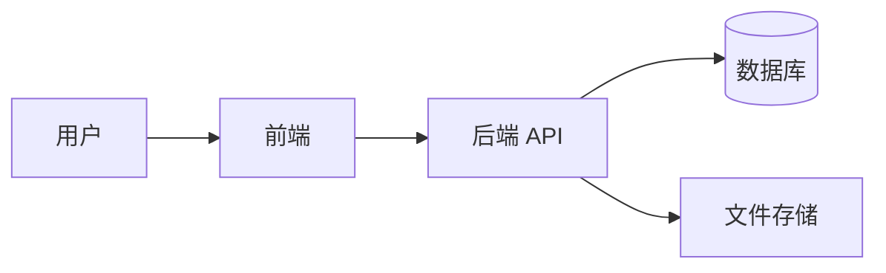

# {{title}}

## 文档信息

- 项目名称：
- 负责人：
- 更新时间：
- 适用环境：

## 背景

说明项目建设背景、业务目标和当前阶段。

## 总体架构

描述系统边界、核心模块、上下游依赖和主要数据流。

## 模块说明

| 模块 | 职责 | 负责人 | 备注 |
| --- | --- | --- | --- |
|  |  |  |  |

## 核心链路

1. 
2. 
3. 

## 部署结构

说明服务器、端口、域名、进程守护、反向代理和数据目录。

## 风险与改进

- 

