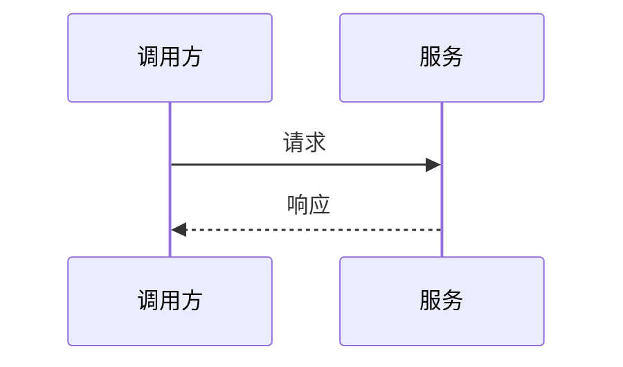

# {{title}}

## 背景

说明问题背景、现状和为什么需要这个方案。

## 目标

- 

## 非目标

- 

## 方案设计

描述整体设计、核心流程、数据结构和关键决策。

## 方案对比

| 方案 | 优点 | 缺点 | 结论 |
| --- | --- | --- | --- |
|  |  |  |  |

## 风险

| 风险 | 影响 | 应对 |
| --- | --- | --- |
|  |  |  |

## 实施计划

1. 
2. 
3. 

